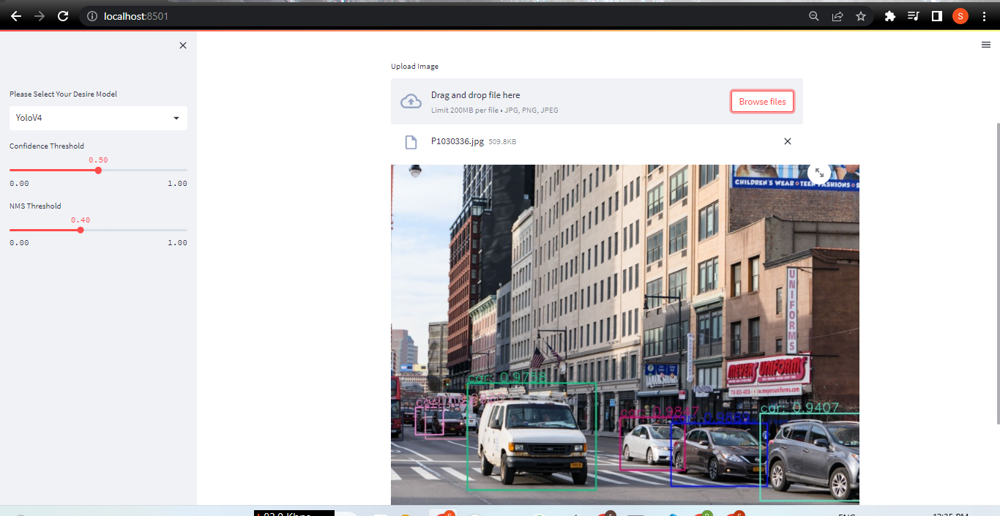
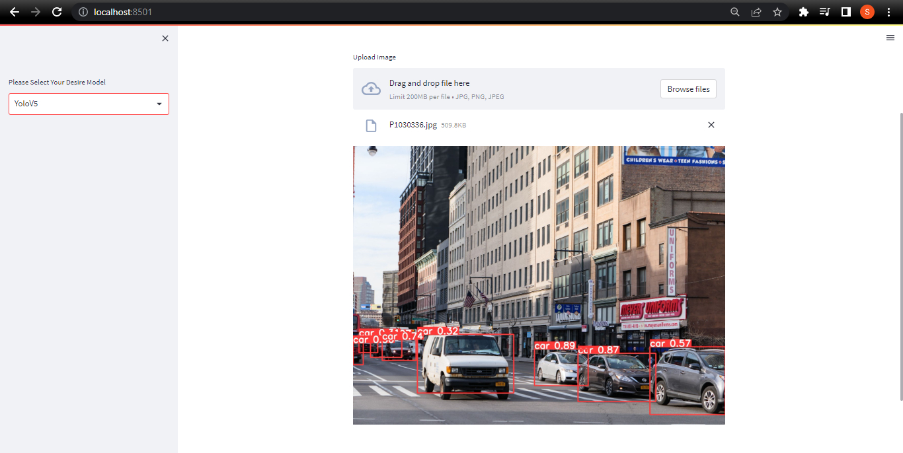

# Car-Detection-Using-YOLOv4-YOLOv5

It's Car dataset which I have downloaded from Kaggle, It has around 1000 Images.It has only one class named car.I have trained this dataset on both YOLOv4 and YOLOv5. Both model are detecting well.but YOLOv4 is much better than YOLOv5.this is dataset link:- [Click here to download this dataset](https://www.kaggle.com/datasets/sshikamaru/car-object-detection)

## Library

* Python
* Numpy
* matplotlib
* Open-Cv
* Streamlit
* YOLOV5
* torch
* IPython
* pathlib

## Tools

* Google Colab
* Visual Studio
 
 ## Deployment
 
* For Deployement I used streamlit and I've followed such steps:-
* Create a Folder
* make a file named requirements.txt and put all the required library inside it.
* Create a Virtual Environment inside this folder Follow these Steps -
* Open your command prompt in VS Code and write this command (python -m venv VE_name) and hit enter.
* After that you need to activate this virtual environment for that write this command (VE_name\Scripts\activate) and hit enter.
* You've Activated your virtual environment and you need to install all your required library for creating this app.
* Then Create a python file and write code for streamlit app
* Fro executing this code run this command in command prompt (streamlit run python_file_name.py)

## Frontend Output
#### For YOLOv4-

#### For YOLOv5-

